# Accedere a Home Assistant in una rete di tipo ___NAT___

In alcune installazioni _"non domestiche"_ di [Home Assistant](https://www.home-assistant.io/), come in impianti di telegestione di un casolare in campagna o comunque in tutte quelle situazioni in cui non si ha la disponibilità di una rete internet fissa, si fa ricorso alle classiche _"saponette"_ WIFI connesse tramite rete mobile.

Nelle reti mobili, per sopperire alla scarsità degli indirizzi IP disponibili, quasi sempre viene adottato il [___Source NAT___](https://it.wikipedia.org/wiki/Network_address_translation) (SNAT) e purtroppo pochi gestori  di telefonica mobile (credo al momento solo TIM) e solo dopo esplicita richiesta, e non poche ritrosie da parte del Gestore stesso, concedono l'assegnazione di un indirizzo IP pubblico. 

Per accedere, esternamente della rete locale creata dalla _"saponetta"_ WIFI, al nostro Home Assistant abbiamo pertanto bisogno di aggirare in problema del __NAT__. 

Vi sono due possibili alternative: 

1. soluzione "banale"; 
2. soluzione _"nerd"_.

## Soluzione _"banale"_ :-P 

[Nabu Casa](https://www.nabucasa.com/) offre, al costo di una sottoscrizione di un abbonamento mensile, la possibilità di gestire la nostra installazione di Home Assistant direttamente dal cloud. Inoltre, tramite Nabu Casa, la gestione dei rinnovi dei certificati SSL per garantire una connessione sicura è automatizzata pertanto, in ultima analisi, questa è __LA__ ___soluzione comoda___.

## Soluzione _nerd_

Se ti sei spinto fin qui nella lettura è perché hai voglia di sperimentare! ;-) Benissimo! Armati di un minimo di pazienza...si parte! 

### Prerequisiti 

Gli _ingredienti_ che serviranno al raggiungimento del nostro scopo saranno:

- servizio _Home Assistant_ attivo e funzionante;
- creazione di un subdomain su DuckDNS;
- accesso a Google Cloud Platform (GCP);
- dimestichezza con alcuni comandi Linux;
- ...voglia di _sporcarsi_ le mani.

### Installazione di _Home Assistant_

Rimando alla guida ufficiale di _Home Assistant_ essendo questa molto ben fatta ed esaustiva nelle diverse tipologie di installazione.

- Installazione manuale ~> [https://www.home-assistant.io/docs/installation/raspberry-pi/](https://www.home-assistant.io/docs/installation/raspberry-pi/)
- Installazione HassOS ~> [https://www.home-assistant.io/hassio/installation/](https://www.home-assistant.io/hassio/installation/)

In definitiva dovremo avere il servizio attivo sulla porta _8123_ del nostro Raspberry Pi.

### DuckDNS

Effettuiamo l'accesso su  ___DuckDNS___ ([https://www.duckdns.org/](https://www.duckdns.org/)) e creiamo un subdominio chiamandolo ad esempio _lamiacasadicampagnia_. Il dominio creato avrà pertanto il seguente nome: ___lamiacasadicampagnia.duckdns.org___. Al momento non prestiamo attenzione all'indirizzo IP segnato poiché, come vedremo nei passi successivi, verrà automaticamente modificato.

### Google Cloud Platform

Creiamoci, se non l'abbiamo già, un accesso a [Google Cloud Platform](https://cloud.google.com/) e lo colleghiamo ad un nostro account Google. Ricordo, qualora non conosceste il servizio GCP, che al momento dell'iscrizione avremo un _credito bonus_ di 300$ da poter consumare sui servizi messi a disposizione da Google. Nel processo di creazione dell'account dovremo comunque apporre gli estremi della nostra carta di credito nel caso dovessimo sforare il budget concesso o il periodo di prova (per la nostra soluzione i costi saranno ___irrisori___ ovvero prossimi ai centesimi di euro o meno).


Compiliamo anche la seconda parte del wizard e concludiamo il processo di creazione dell'account su GCP.

Accediamo alla sezione ___Compute Engine___:

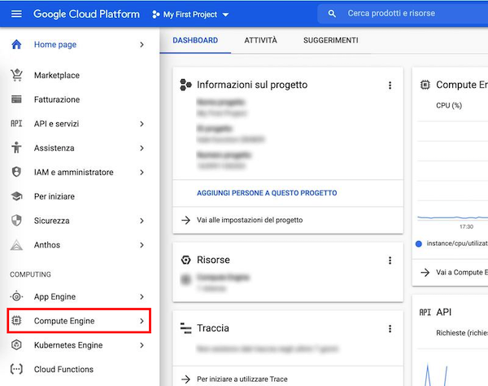

Creiamo una istanza VM chiamandola ad esempio ___homeassistantmanager___. Scegliamo l'area geografica e la zona a noi più vicina o più conveniente (verranno riportate sulla destra della pagina le previsioni di spesa). Atteniamoci inoltre alla scelta della più piccola configurazione (e dal costo minore!) ovvero ___e2-micro___ poiché a noi servirà davvero un uso minimale delle risorse:

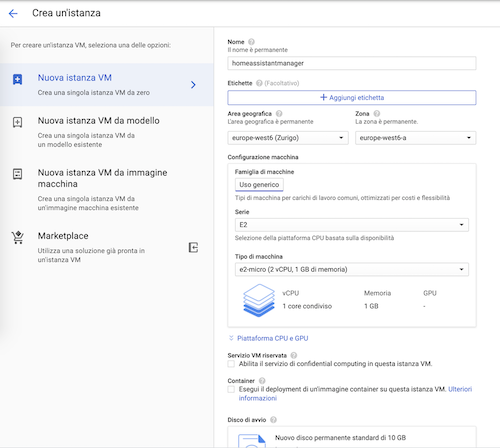

Useremo una distribuzione Linux Debian (versione Buster) e dovremo consentire, nella sezione firewall, il traffico HTTP e HTTPS. Procediamo con le scelte e creiamo l'istanza. 

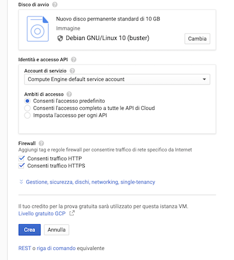

Terminata la fase di creazione dell'istanza avremo la seguente situazione:

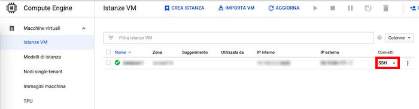

Accediamo tramite il link __SSH__ all'istanza creata e procediamo come _superuser_:

```
$ sudo su
```


### Preparazione dell'ambiente

Creiamo una regola sul firewall che, come vedremo, ci servirà in futuro per rendere fruibile la VPN e verifichiamo che la regola sia stata correttamente creata:

```
$ gcloud compute firewall-rules create wireguardrule --allow udp:51820
$ gcloud compute firewall-rules list
```

___ATTENZIONE___: nel caso in cui emergesse un problema di permessi mancanti per la generazione della regola del firewall, accertatevi di aver autorizzato il vostro account Google alle risorse della VM creata: eseguite il processo di autenticazione e autorizzazione:

```
$ gcloud auth login
```

Rendiamo il sistema pronto per l'installazione di WireGuard pertanto, per la compilazione del modulo del kernel, saranno chiaramente necessari gli headers, poi installeremo [___rinetd___](http://www.rinetd.com/) per effettuare il redirect delle chiamate sul dominio pubblico verso il client VPN e, per ultimo, installeremo _curl_ che ci servirà sia per invocare il servizio DuckDNS sia per eseguire l'installazione di  PiVPN: scelgo di usare questa utility poiché sono _"pigro"_ e mi risultano comodi gli script di installazione ed configurazione automatizzati. 

```
$ sudo apt update
$ sudo apt upgrade
$ sudo apt install rinetd curl linux-headers-$(uname -r)
```

### Aggiornamento automatico del dominio

Eseguiamo i seguenti passi per automatizzare l'aggiornamento dell'IP su [___DuckDNS___ ](https://www.duckdns.org/):

```
$ mkdir duckdns_lamiacasadicampagnia
$ cd duckdns_lamiacasadicampagnia/
$ nano duck.sh
```

Inseriamo nel file _duck.sh_ il seguente contenuto:

```
echo url="https://www.duckdns.org/update?domains=lamiacasadicampagnia&token=[inserire_qui_il_token_di_duckdns]&ip=" | curl -k -o ./duck.log -K -
```

Salviamo ed usciamo da nano (CRTL+O e CRTL+X). Diamo i permessi di esecuzione allo script _duck.sh_:

```
$ chmod +x duck.sh
$ ./duck.sh
```

Adesso, nella directory `duckdns_lamiacasadicampagnia` dovrebbe essere presente un file di log _duck.log_ contenente un bel _OK_ ovvero abbiamo appena aggiornato l'associazione del dominio scelto con l'IP della VM su GCP.

Configuriamo il demone cron in modo da eseguire lo script:

```
$ sudo crontab -e
```

ed inseriamo la seguente programmazione:

```
$ */5 * * * * /home/[nome_utente]/duckdns_lamiacasadicampagnia/duck.sh >/dev/null 2>&1
```

Salviamo ed usciamo dall'editor di cron (CRTL+O e CRTL+X). Riavviamo il servizio:

```
$ sudo service cron restart
```

Adesso ogni 5 minuti verrà aggiornata l'associazione _dominio vs IP_.

### Installazione VPN con WireGuard tramite PiVPN

Procediamo con l'installazione di _PiVPN_ lasciando tutte le configurazioni di default e quindi scegliamo [___WireGuard___](https://www.wireguard.com/): 

```
$ curl -L https://install.pivpn.io | bash
```

Nel processo di installazione dobbiamo scegliere la porta __51820 UDP__ inoltre dovremo inserire il nome di dominio scelto su ___DuckDNS___ ovvero ad esempio __lamiacasadicampagnia.duckdns.org__ .

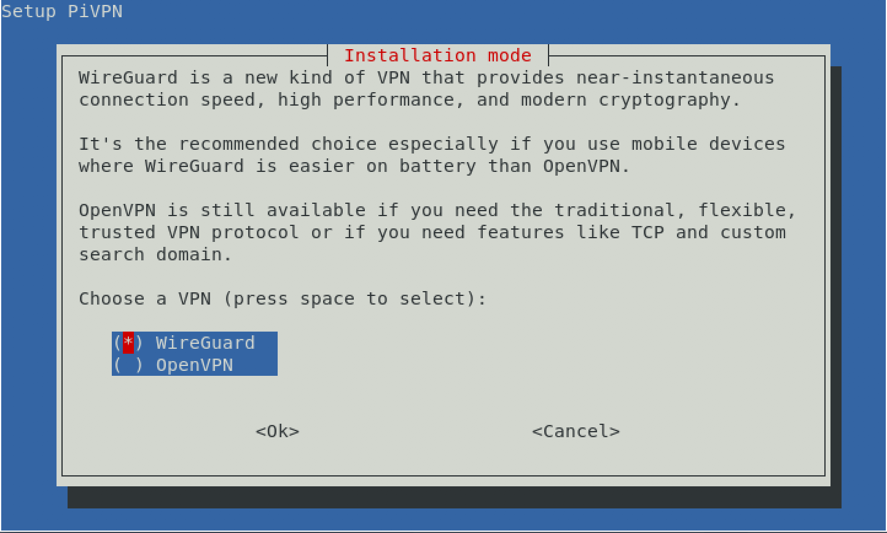

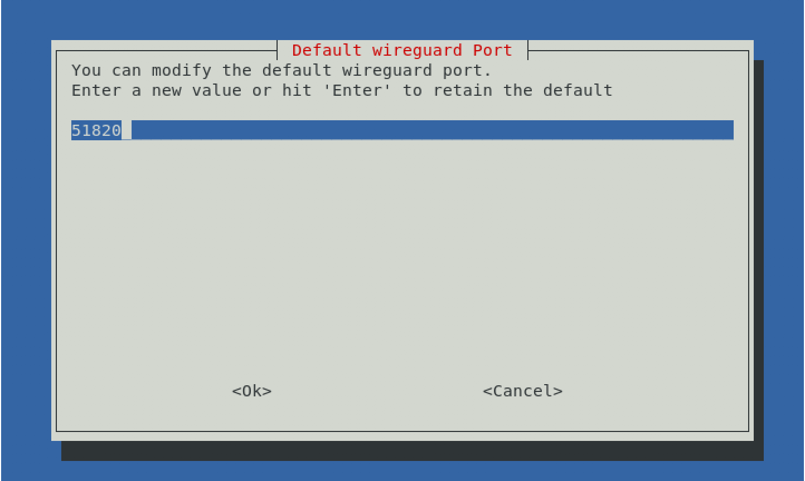

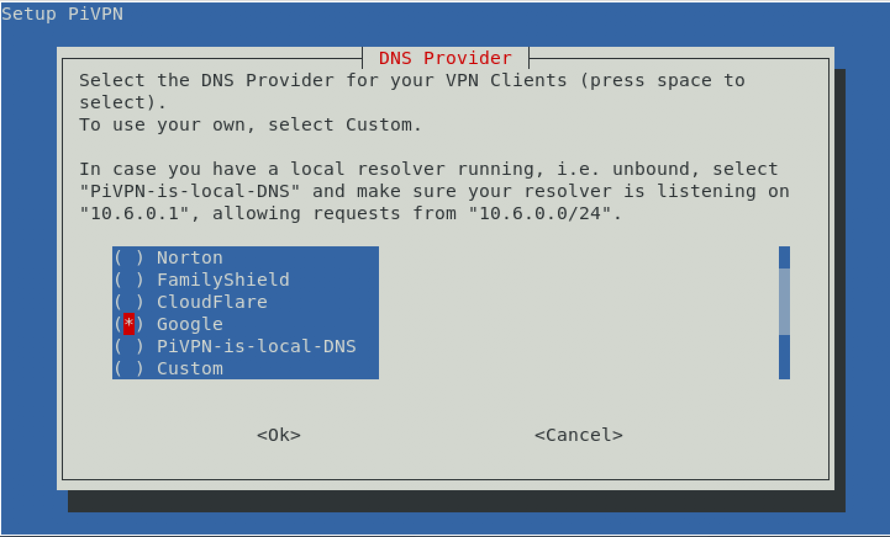

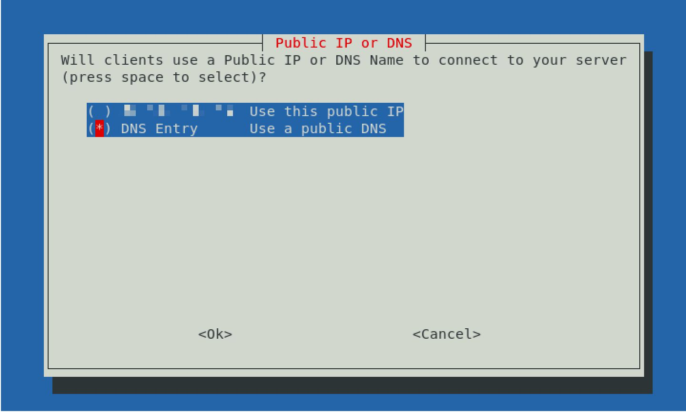

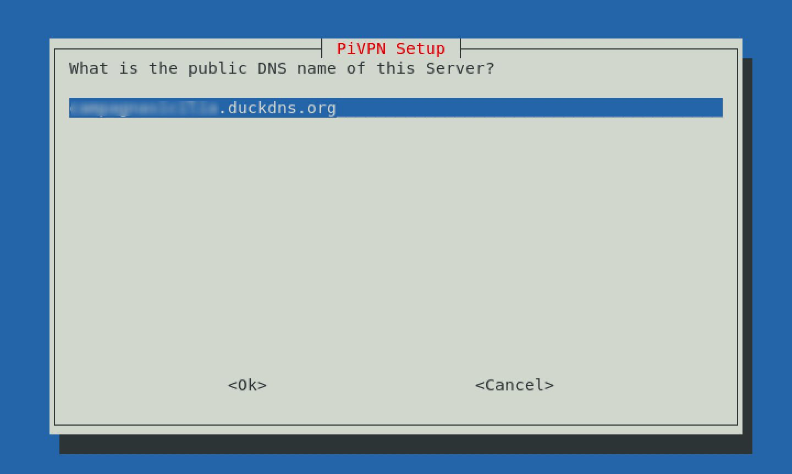

e confermiamo il tutto.

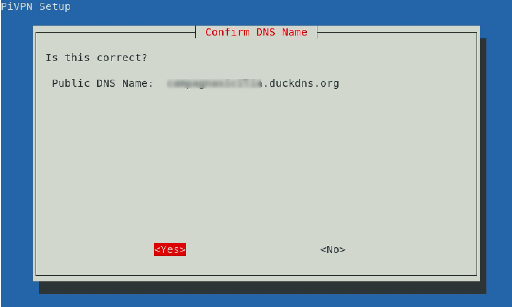

Proseguiamo il wizard confermando le opzioni di default e completiamo il processo. Al termine ci verrà richiesto di effettuare un reboot, facciamolo!

Al successivo riavvio sinceriamoci che WireGuard sia operativo come modulo del kernel:

```
$ lsmod | grep "wireguard"
```

dovrebbe, auspicatamente, apparire in lista:

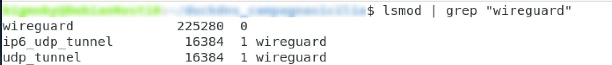


### Redirezione delle chiamate con _rinetd_

Installiamo il demone [_rinetd_](http://www.rinetd.com/) che ci permetterà di inoltrare tutte le chiamate entranti dall'indirizzo pubblico (ovvero il nostro dominio scelto) e porta 80 verso l'IP del client VPN operante su WireGuard:

```
$ sudo apt install rinetd
```

Configuriamo il demone:

```
$ nano /etc/rinetd.conf
```

Inseriamo questa riga nel suddetto file di configurazione di _rinet_

```
# bindadress    bindport  connectaddress  connectport
0.0.0.0         80        10.6.0.2        8123
```

Salviamo ed usciamo dall'editor nano (CRTL+O e CRTL+X). Riavviamo il servizio:

```
$ sudo service rinetd restart
```

Adesso tutte le richieste inoltrate verso il dominio _lamiacasadicampagna.duckdns.org_ verranno dirottate verso l'indirizzo IP __10.6.0.2__ ovvero verso il client VPN in cui girerà il servizio di _Home Assistant_.

### Configurazione _WireGuard_

Creiamo una configurazione per il client che girerà sulla nostra piattaforma in cui risiede _Home Assistant_ e scegliamo il nome _homeassistanthost_:

```
$ pivpn add 
```

Verrà generato un file che, come verrà spiegato successivamente in questa guida, dovremo riportare sulla macchina VPN client.

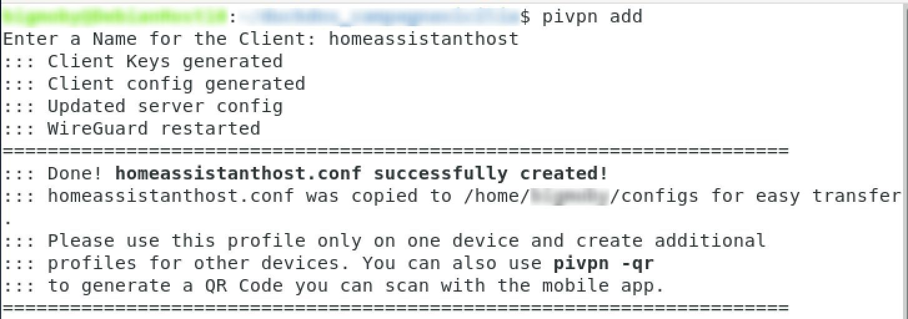

Il suddetto file _homeassistanthost.conf_ conterrà la chiave privata del client VPN, la chiave pubblica del nostro host VPN e gli estremi di connessione ovvero il nome del dominio da noi scelto e la porta in uso.


## Installazione di _WireGuard_ client

Una volta eseguiti tutti i passi qui sopra esposti, dovremo adesso dedicarci a predisporre la nostra piattaforma su cui gira _Home Assistant_ (nel 99% dei casi consiste in un Raspberry Pi pertanto darò per assodato che sia in uso tale sistema) affinché diventi un client della nostra rete VPN appena creata sull'istanza VM in _GCP_.

Effettuiamo il login sul nostro Raspberry Pi ed installiamo _WireGuard_:

```
$ sudo apt update
$ sudo apt upgrade
$ sudo apt install wireguard
```

creiamo il file _wg0-client.conf_ e copiamo il contenuto del file generato sull'host VPN (file _homeassistanthost.conf_):

```
$ sudo nano /etc/wireguard/wg0-client.conf
```

aggiungiamo all'ultima riga la seguente propietà:

```
PersistentKeepalive=25
```

In definitiva la configurazione del client VPN sarà indicativamente così:

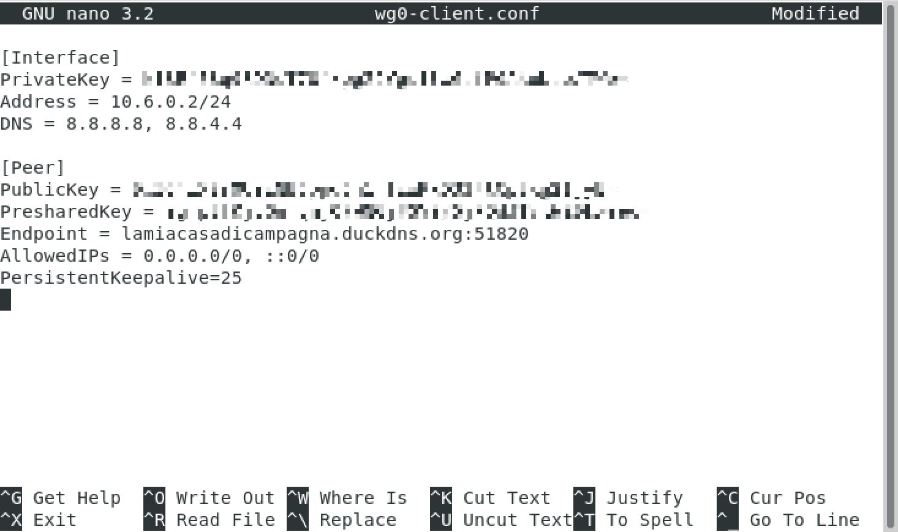

Avviamo il servizio del client ed attiviamolo in modo che ad eventuali riavvi del sistema si connetterà alla VPN in automatico:

```
$ sudo systemctl start wg-quick@wg0-client
$ sudo systemctl enable wg-quick@wg0-client
```

Il nostro obiettivo è raggiunto: adesso il servizio _Home Assistant_ che gira su una rete _nattata_ è raggiungibile dall'esterno.

## Considerazioni finali

La soluzione tecnica qui presentata soffrirà sicuramente di un minimo di latenza soprattutto in fase di prima connessione poiché tutto il traffico verrà ruotato sulla VPN tuttavia il servizio di _Home Assistant_ rimane assolutamente fruibile.

## Contribuisci

Se trovate inesattezze o errori vi prego di contribuire mandando una _pull request_ con la vostra correzione.

## Supporto
Se il progetto ti è stato utile e vuoi lasciare un contributo

<a href="https://www.buymeacoffee.com/bigmoby" target="_blank"></a>

Ti ringrazio

## Licenza 

Questo lavoro è concesso in licenza [Creative Commons Attribution-ShareAlike 4.0
International License][cc-by-sa].

[![CC BY-SA 4.0][cc-by-sa-image]][cc-by-sa]

[cc-by-sa]: http://creativecommons.org/licenses/by-sa/4.0/
[cc-by-sa-image]: https://licensebuttons.net/l/by-sa/4.0/88x31.png
[cc-by-sa-shield]: https://img.shields.io/badge/License-CC%20BY--SA%204.0-lightgrey.svg


