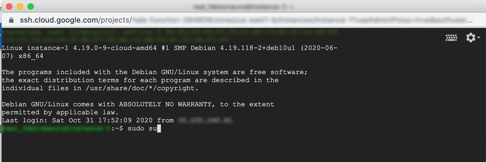

# Accedere a Home Assistant in una rete di tipo NAT (parte 2)
## Obiettivo: creare un canale di comunicazione via ___https___

Come discusso nella [prima parte della guida](https://github.com/bigmoby/homeassistant_nat_network/) abbiamo adesso una installazione di Home Assistant, operante in una rete di tipo NAT, che sarà fruibile anche all'esterno della LAN. Tuttavia il protocollo di comunicazione, al momento, opera in chiaro ovvero non via SSL. 

In questa seconda parte della guida risolveremo anche questa limitazione e potremo raggiungere Home Assissant tramite ___https___ rendendo la comunicazione sicura.

## Preparazione dell'ambiente Google Cloud Platform
Accediamo alla nostra istanza VM, tramite il link __SSH__, e procediamo come _superuser_:


```
$ sudo su
```



Effettuiamo un aggiornamento dei pacchetti installati

```
# apt update
# apt upgrade
```

e stoppiamo il servizio rinetd:

```
# systemctl stop rinetd
```

## Installazione di NGINX
Attualmente il demone Rinet si occupava di effettuare il redirect di tutte le richieste entranti dalla porta 80 e le ruotava all'indirizzo di rete del nostro client VPN (10.6.0.2) e porta 8123 su cui gira l'installazione di Home Assistant.

Le modifiche architetturali che andremo ad apportare consisteranno nel sostituire il semplice demone di redirect con [NGINX](https://nginx.org/), un web server spesso usato come reverse/proxy. Questa modifica ci consentirà di poter gestire i certificati ssl e quindi ruotare la richiesta nuovamente verso il nostro client VPN.

Procediamo con l'installazione di NGINX:

```
# apt install nginx
```

Al termine dell'installazione se provassimo ad invocare il nostro servizio, su cui precedentemente girava Home Assistant ovvero `http://lamiacasadicampagna.duckdns.org`, otterremo il seguente risultato:


Bene. Adesso creiamo un file di configurazione appropriato:

```
# nano /etc/nginx/sites-available/lamiacasadicampagna.duckdns.org
```

e copiamo il seguente contenuto con le dovute modifiche ovvero prestiamo attenzione alla configurazione del parametro `server_name` e l'indirizzo del nostro client VPN espresso dal parametro `proxy_pass`:

```
server {
        listen 80 default_server;
        listen [::]:80 default_server;
        server_name lamiacasadicampagna.duckdns.org;
        location / {
                proxy_pass http://10.6.0.2:8123;
                proxy_redirect off;
                proxy_set_header Host $host;
                proxy_set_header X-Real-IP $remote_addr;
                proxy_set_header X-Forwarded-For $proxy_add_x_forwarded_for;
                proxy_set_header X-Forwarded-Host $server_name;
                proxy_set_header X-Forwarded-Proto $scheme;
                proxy_http_version 1.1;
                proxy_set_header Upgrade $http_upgrade;
                proxy_set_header Connection "Upgrade";
                chunked_transfer_encoding off;
                proxy_buffering off;
                proxy_cache off;
        }
}
```

Non mi soffermo alla spiegazione di ogni riga di comando della configurazione poiché sia non è lo scopo di questa guida sia la documentazione di NGINX è davvero ben fatta ed esaustiva in ogni punto.

Rendiamo potenzialmente attiva la suddetta configurazione creando un link simbolico dentro la directory `sites-available` e rimuoviamo il servizio di default:

```
# ln -s /etc/nginx/sites-available/lamiacasadicampagna.duckdns.org /etc/nginx/sites-enabled/lamiacasadicampagna.duckdns.org
# rm /etc/nginx/sites-enabled/default 
```

verifichiamo che la configurazione non contenga errori:

```
# sudo nginx -t
```

Se tutto ok allora riavviamo il servizio:

```
# sudo systemctl reload nginx
```

Come certamente avremo notato il servizio gira ancora in chiaro ovvero in _http_, difatto, al momento, abbiamo solo sostituito il demone rinetd con NGINX e manca la gestione dei certificati.

## Installazione di Certbot
[Certbot](https://certbot.eff.org/) è un software opensource che permette la creazione ed il mantenimento dei certificati per le connessioni in ___HTTPS___. Procediamo con l'installazione dei prerequisiti ed infine dello stesso Certbot per nginx: 

```
# apt install python3-acme python3-certbot python3-mock python3-openssl python3-pkg-resources python3-pyparsing python3-zope.interface
# apt install python3-certbot-nginx
```

__verifichiamo che la porta 443 sia fruibile da parte del firewall di GCP__:

```
# gcloud compute firewall-rules list
```

Se abbiamo seguito la [prima parte della guida](https://github.com/bigmoby/homeassistant_nat_network/) dovrebbe essere aperta!

Adesso possiamo procedere con la creazione dei certificati e con l'autoconfigurazione che Certbot eseguirà sulla nostra instanza NGINX:

```
# certbot --nginx -d lamiacasadicampagna.duckdns.org
```

Accettiamo i termini della licenza d'uso del servizio e quando ci verrà posta la domanda se redirezionare il traffico della porta 80 rispondiamo affermativamente ovvero scelta `2`:

```
Please choose whether or not to redirect HTTP traffic to HTTPS, removing HTTP access.
- - - - - - - - - - - - - - - - - - - - - - - - - - - - - - - - - - - - - - - -
1: No redirect - Make no further changes to the webserver configuration.
2: Redirect - Make all requests redirect to secure HTTPS access. Choose this for
new sites, or if you're confident your site works on HTTPS. You can undo this
change by editing your web server's configuration.
- - - - - - - - - - - - - - - - - - - - - - - - - - - - - - - - - - - - - - - -
Select the appropriate number [1-2] then [enter] (press 'c' to cancel): 2
```

A questo punto potremo procedere alla verifica della corretta installazione dei certificati SSL sul nostro dominio visitando il servizio:

`https://www.ssllabs.com/ssltest/analyze.html?d=lamiacasadicampagna.duckdns.org `

Se tutto è ok allora procediamo con la disabilitazione del servizio rinet:

```
# systemctl disable rinetd
```

## Mantenimento dei certificati
I certificati appena creati dureranno 90 giorni pertanto dovremo ricordarci di rinnovarli entro tale periodo altrimenti non riusciremo a raggiungere il nostro Home Assistant. Possiamo automatizzare questo processo di rinnovo inserendo un nuovo task al demone _cron_:

```
# crontab -e 
```

ed inseriamo il seguente comando al fine di tentare il rinnovo sue volte al giorno, ogni giorno (vi _sconsiglio_ di tentare un approccio più conservativo come lo scheduling settimanale o addirittura mensile): 

```
22 11,23 * * * certbot renew --pre-hook "service nginx stop" --post-hook "service nginx start"
```

Salviamo e usciamo da nano (CRTL+O e CRTL+X).

Riavviamo il servizio _cron_:

```
# service cron reload

```

## Considerazioni finali

La soluzione qui presentata vi permetterà sia di accedere al servizio di _Home Assistant_ in modo sicuro sia, come _effetto collaterale_, di poter usufruire dei servizi _Amazon Alexa_ o _Google Home_ che necessitano obbligatoriamente di una comunicazione via ___https___.

## Contribuisci

Se trovate inesattezze o errori vi prego di contribuire mandando una _pull request_ con la vostra correzione.

## Supporto
Se il progetto ti è stato utile e vuoi lasciare un contributo

<a href="https://www.buymeacoffee.com/bigmoby" target="_blank"></a>

Ti ringrazio

## Licenza 

Questo lavoro è concesso in licenza [Creative Commons Attribution-ShareAlike 4.0
International License][cc-by-sa].

[![CC BY-SA 4.0][cc-by-sa-image]][cc-by-sa]

[cc-by-sa]: http://creativecommons.org/licenses/by-sa/4.0/
[cc-by-sa-image]: https://licensebuttons.net/l/by-sa/4.0/88x31.png
[cc-by-sa-shield]: https://img.shields.io/badge/License-CC%20BY--SA%204.0-lightgrey.svg